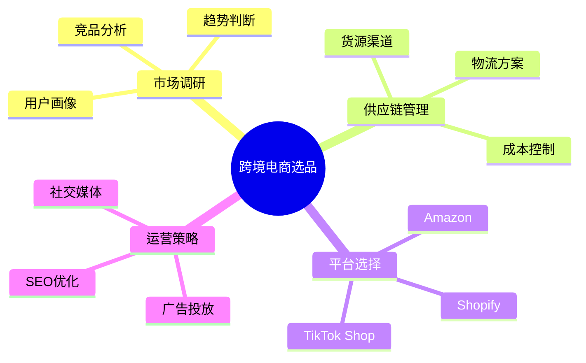
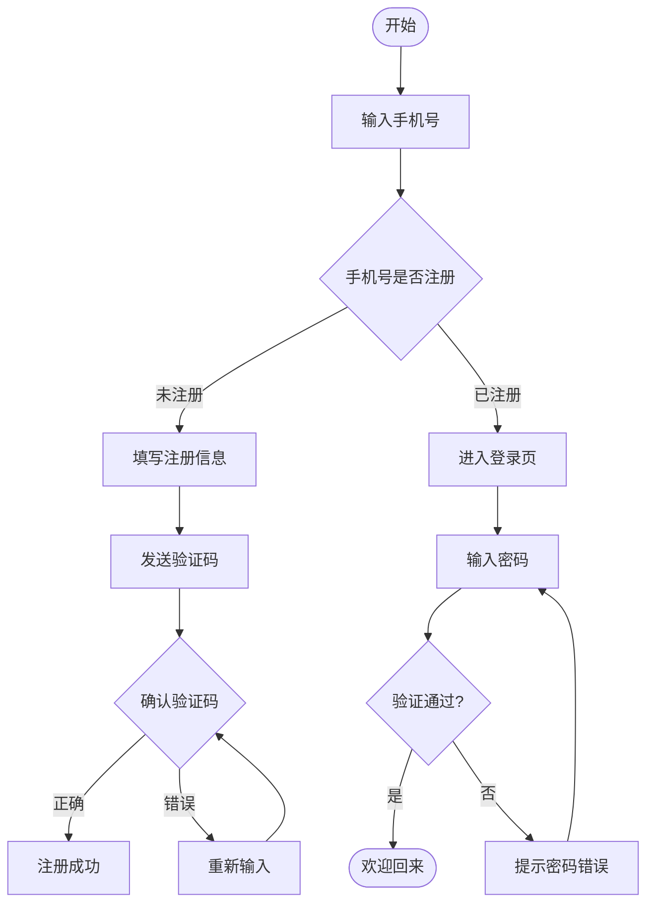

你是不是经常有这样的场景：脑子里有一堆想法，想理清楚却无从下手？开会时大家讨论了很多内容，回去整理笔记发现一团乱麻？做一个新项目，任务拆解不知道从何开始？

以前画思维导图和流程图，你需要买软件、学操作、调样式，折腾半天最后还不好看。现在有了 AI，整个过程可以压缩到几分钟——你只需要把想法告诉 AI，它就能帮你生成结构清晰、可以直接使用的图表。

本文手把手教你用 ChatGPT + Mermaid + 免费在线工具，从零开始做出专业的思维导图和流程图，全程不用写一行代码。

---

## 一、为什么你应该用 AI 来做图表？

先说结论：**AI 做图的核心价值不是"好看"，而是"理清思路"。**

传统画思维导图的流程是：打开软件 → 思考结构 → 逐个输入节点 → 调整层级 → 美化样式。每一步都要你自己来，大脑既要想内容又要管格式，效率极低。

用 AI 做图完全不一样。你把问题描述给 AI，它帮你完成最关键的一步——**信息结构化**。思维导图的本质是把散乱的想法组织成层次分明的结构，这正是 AI 最擅长的事情。至于样式和排版，Mermaid 等工具可以一键渲染，连颜色都不用调。

举个例子：你想做一个"个人年度学习计划"，直接告诉 ChatGPT "帮我做一个个人年度学习计划的思维导图，涵盖编程、英语、理财、健身四个方向，每个方向列出具体的月度目标"，它会在 10 秒内给你一个完整的结构。你只需要复制粘贴到渲染工具里，一张精美的思维导图就出来了。

---

## 二、准备工作：三个零成本工具

整个流程只需要三个工具，全部免费：

**第一步：ChatGPT（或 Claude、Kimi）** —— 用来生成结构化内容。如果你没有 ChatGPT 账号，可以用 [Kimi](/tools/kimi/) 或 [通义千问](/tools/tongyi-qianwen/)，它们都能很好地理解中文指令并输出结构化内容。

**第二步：Mermaid Live Editor** —— 一个在线的图表渲染工具，把文本描述直接变成图表。打开 <https://mermaid.live> 就行，不需要安装任何东西。

**第三步：VS Code + Mermaid 插件**（可选）—— 如果你经常需要做图表，可以在 VS Code 里装 Mermaid 插件，直接在编辑器里预览，更方便。

这三个工具加起来，就是你要的全部家当。不需要买任何软件，不需要注册任何付费服务。

---

## 三、实操一：用 AI 生成思维导图

### 3.1 让 ChatGPT 输出 Mermaid 代码

这是最核心的步骤。很多人不知道，ChatGPT 可以直接输出 Mermaid 格式的语法代码，而 Mermaid 是一种用纯文本描述图表的语言。

**操作方法**：打开 ChatGPT，输入以下指令：

```
请帮我生成一个关于"[你的主题]"的思维导图，使用 Mermaid mindmap 语法输出。
要求：
1. 中心主题放在最上面
2. 至少包含 3 个一级分支
3. 每个一级分支下至少有 2 个二级子节点
4. 直接输出 Mermaid 代码，不要额外的解释
```

比如你要做"跨境电商选品分析"的思维导图，指令就是这样：

```
请帮我生成一个关于"跨境电商选品分析"的思维导图，使用 Mermaid mindmap 语法输出。
要求：
1. 中心主题放在最上面
2. 至少包含 3 个一级分支
3. 每个一级分支下至少有 2 个二级子节点
4. 直接输出 Mermaid 代码，不要额外的解释
```

ChatGPT 会返回类似这样的代码：



### 3.2 渲染成可视化图表

把 ChatGPT 输出的代码复制下来，打开 [Mermaid Live Editor](https://mermaid.live)，粘贴进去，右边就会立刻显示出一张漂亮的思维导图。

你会发现它默认就是圆角卡片样式，配色也很协调。如果你觉得不满意，Mermaid Live Editor 右上角有几个预设主题可以切换——暗黑模式、清新模式、温暖模式，点一下就能换。

**小技巧**：如果生成的思维导图太复杂，可以在指令里加上"不超过 15 个节点"的限制；如果觉得不够详细，加上"每个分支至少展开到三级"的要求。多试两次就能找到最适合你需求的粒度。

### 3.3 导出和使用

渲染满意后，点击 Mermaid Live Editor 的"Export"按钮，可以选择导出为 PNG、SVG 或 PDF 格式。PNG 适合发到微信群或朋友圈，SVG 适合插入文档或 PPT，PDF 适合打印。

---

## 四、实操二：用 AI 生成流程图

流程图和思维导图不同，它关注的是"步骤"和"逻辑关系"，适合用来梳理业务流程、操作步骤、决策路径等场景。

### 4.1 让 ChatGPT 生成 Mermaid 流程图代码

打开 ChatGPT，输入：

```
请帮我画一个"[场景描述]"的流程图，使用 Mermaid flowchart 语法。
要求：
1. 用矩形表示步骤，菱形表示判断，圆角矩形表示开始/结束
2. 标注清楚每个判断分支的条件
3. 直接输出 Mermaid 代码，不要额外解释
```

比如你想梳理"用户注册登录流程"：

```
请帮我画一个"网站用户注册登录流程"的流程图，使用 Mermaid flowchart 语法。
要求：
1. 用矩形表示步骤，菱形表示判断，圆角矩形表示开始/结束
2. 标注清楚每个判断分支的条件
3. 直接输出 Mermaid 代码，不要额外解释
```

ChatGPT 会返回类似这样的代码：



### 4.2 渲染和微调

同样粘贴到 Mermaid Live Editor 中。流程图默认是从上到下排列的，如果你更喜欢从左到右的布局，可以把 `TD`（Top-Down）改成 `LR`（Left-Right）。

**实用场景举例**：

- **项目进度管理**：让 ChatGPT 帮你生成一个项目从立项到交付的完整流程图，标注每个阶段的负责人和交付物
- **客服应答流程**：梳理客服面对不同类型问题时的处理路径，新客服一看就懂
- **内容创作流程**：从选题到发布的完整步骤，适合自媒体团队标准化作业

### 4.3 进阶：用 AI 生成带条件的复杂流程图

很多流程图中有"循环"和"并行"的逻辑，ChatGPT 也能处理。你可以在指令中加入更具体的要求：

```
在流程中加入并行处理的分支，用 parallel 语法表示。
对于审批流程，加入多级审批的判断节点。
```

ChatGPT 会生成带有并行分支和多层判断的复杂流程图，直接粘贴到 Mermaid 中就能渲染。

---

## 五、实操三：用 AI 做表格对比图

除了思维导图和流程图，还有一个经常被忽略但超级实用的场景：**用 AI 生成表格对比图**。

当你需要对比多个工具、产品或服务时，文字描述往往不够直观。用 Mermaid 的 `classDiagram` 或简单的表格语法，可以让对比一目了然。

打开 ChatGPT，输入：

```
请帮我做一个"[对比主题]"的对比表格，使用 Mermaid 语法输出。
对比维度包括：[维度1]、[维度2]、[维度3]
要求：
1. 至少对比 5 个选项
2. 标注每个维度的优缺点
3. 直接输出 Mermaid 代码
```

比如对比"主流 AI 编程助手"：

```
请帮我做一个"AI 编程助手对比"的表格，使用 Mermaid 语法。
对比维度包括：价格、支持语言、代码补全能力、调试功能、团队协作
要求：
1. 至少对比 Cursor、Copilot、Claude Code、Codex、Windsurf
2. 直接输出 Mermaid 代码
```

这个功能在做技术选型、工具评估时特别好用。结合我们网站上的 [AI 工具评测](/reviews/)栏目，你可以快速生成一份可视化的对比图，分享给团队或朋友。

---

## 六、高频使用场景汇总

把前面学到的方法应用到实际场景中，下面是几个最高频的用法：

### 6.1 学习笔记整理

期末复习或自学时，把一章的内容让 ChatGPT 整理成思维导图。指令模板：

```
请把"[章节名称]"的核心知识点整理成思维导图，
按"概念→原理→应用→案例"的结构组织，
输出 Mermaid mindmap 代码。
```

### 6.2 会议记录结构化

开完会后，把会议讨论的要点发给 ChatGPT，让它整理成结构化的流程图或思维导图。这样下次开会前看一眼，就能快速回顾上次的决策和待办事项。

### 6.3 项目计划拆解

接到一个新项目，第一步不是打开项目管理软件，而是让 ChatGPT 帮你做任务拆解：

```
我打算做一个"[项目名称]"，请帮我拆分成阶段和任务，
用 Mermaid 甘特图语法输出时间安排，
同时用 mindmap 语法输出任务层级结构。
```

### 6.4 知识体系构建

长期学习某个领域时，用 AI 帮你维护一张不断扩展的知识地图。每次学完一个新知识点，让 ChatGPT 把它融入到你之前的思维导图中，几年下来你就拥有了一张属于自己的完整知识图谱。

---

## 七、常见问题解答

**Q：生成的图表不好看怎么办？**

Mermaid 的默认样式已经足够清晰了。如果你追求更好的视觉效果，可以在 Mermaid Live Editor 中切换主题，或者在代码里手动添加样式定义。但说实话，大多数场景下默认的简洁风格反而是最专业的。

**Q：ChatGPT 输出的代码有错误怎么办？**

很常见。Mermaid 对语法要求比较严格，一个标点错了就无法渲染。遇到这种情况，把报错信息复制回给 ChatGPT，说"这段代码渲染报错，错误信息是 XXX，请修复"，它通常会很快修正。

**Q：能不能在本地用，不依赖在线工具？**

可以。Mermaid 支持在 Markdown 文件中直接嵌入代码块，许多笔记软件（如 Obsidian、Notion）都原生支持渲染。如果你经常做图表，建议了解一下 [DuckDB](https://duckdb.org/)——它虽然是个数据分析工具，但对于处理大量结构化数据并生成图表来说非常高效，特别适合需要批量处理信息的场景。

**Q：思维导图和流程图我该选哪个？**

简单区分：想梳理"包含什么"用思维导图，想梳理"怎么做"用流程图。前者是树状结构，后者是流程结构。大多数时候两者配合使用效果最好——先用思维导图拆解框架，再用流程图细化每个环节的具体步骤。

---

## 八、总结

用 AI 做思维导图和流程图，本质上是把"思考"和"呈现"两个动作解耦了。以前你既要思考结构又要操心样式，现在你只需要专注思考，剩下的交给 AI 和 Mermaid。

整个流程总结成一句话：**告诉 AI 你要做什么 → AI 生成 Mermaid 代码 → 粘贴到 Mermaid Live Editor 渲染 → 导出使用。**

熟练之后，做一张高质量的思维导图或流程图只需要 2-3 分钟。这比打开任何一款专业软件都要快得多。

从今天开始，下次遇到需要梳理思路的场景，试试用 AI 帮你画一张图吧。你会发现，清晰的图表不仅能帮你更好地理解问题，还能让你的表达更有说服力。
